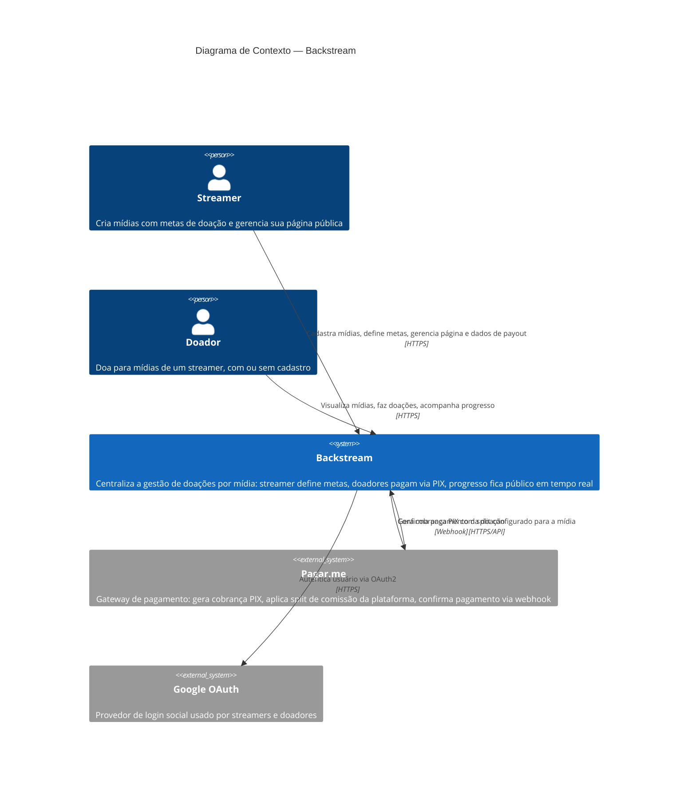

# C4 — Diagrama de Contexto (Backstream)

Visão de mais alto nível: quem usa o Backstream e com quais sistemas externos
ele troca informação. Não entra em módulos internos nem em infraestrutura de
deploy — isso fica para um eventual C4 Container/Deployment, quando a
arquitetura de execução (streamer/media/donation implementados, infra de
produção decidida) estiver mais estável. Para os módulos internos, ver
[`arquitetura-modulos.md`](../../../arquitetura-modulos.md).

## Legenda

- **Pessoa** (retângulo arredondado): ator humano — streamer ou doador.
- **Sistema** (retângulo azul escuro): o Backstream, como caixa única — o que
  há dentro dele é assunto do C4 Container, não deste diagrama.
- **Sistema externo** (retângulo cinza): sistema fora do controle do time —
  Pagar.me e Google. Não modelamos o que acontece dentro deles.
- Rótulos das setas indicam o **propósito** da interação e o protocolo, não
  só a direção.

## Fora de escopo deste diagrama (propositalmente)

- Streamer e doador podem interagir sem cadastro prévio (doação anônima) —
  omitido aqui porque não muda o sistema externo com quem o Backstream troca
  dado, só a forma de autenticação no `donor`.
- Observabilidade (Loki) não aparece: é infraestrutura operacional interna,
  não algo que um streamer/doador ou o negócio percebe como "sistema externo"
  na leitura de contexto — cabe melhor num C4 Deployment futuro.
